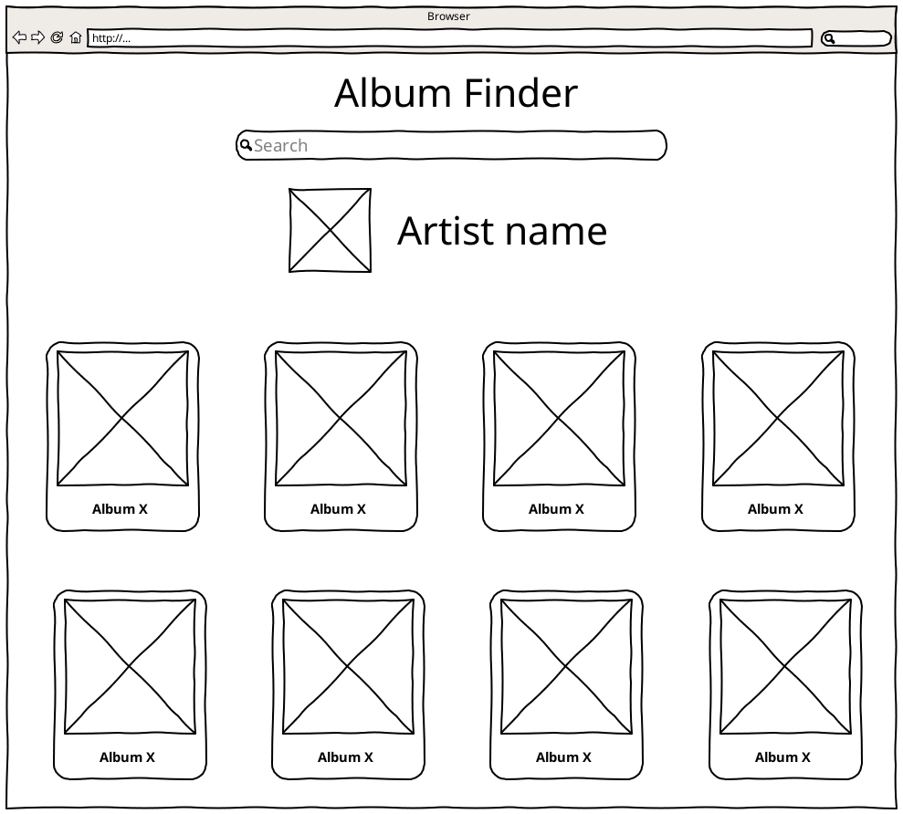
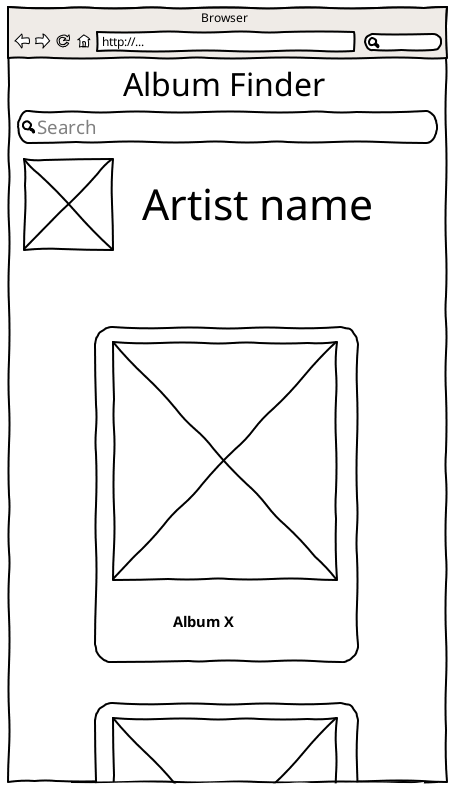

# Critical Mass PWA Test

## Objetivo

Desenvolver uma aplicação para consultar álbuns de um determinado artista

## Stack

- React
- styled-components
  - CSS Grid
- React Hooks _ou_ MobX
- [API GraphQL Spotify](<https://spotify-graphql-server.herokuapp.com/graphql?query=%7B%0A%20%20queryArtists(byName%3A%20%22Metallica%22)%20%7B%0A%20%20%20%20name%0A%20%20%20%20id%0A%20%20%20%20image%0A%20%20%20%20albums%20%7B%0A%20%20%20%20%20%20name%0A%20%20%20%20%20%20id%0A%20%20%20%20%20%20image%20%0A%20%20%20%20%7D%0A%20%20%7D%0A%7D%0A>)
  - Para simplificar o App, considere o primeiro item do array de `queryArtists`
- Service Worker
  - App deve funcionar off-line (manter buscas no cache)

## Wireframes

### Desktop Browser



### Mobile Browser



### Instruções para executar o projeto

```bash
yarn
yarn build
npx serve -s build
```

O app estará disponível em [http://localhost:5000](http://localhost:5000)
