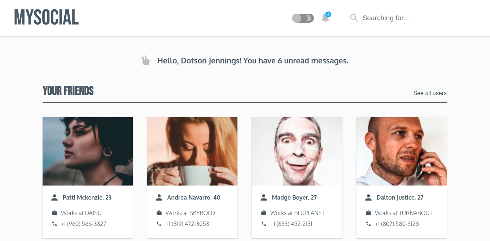
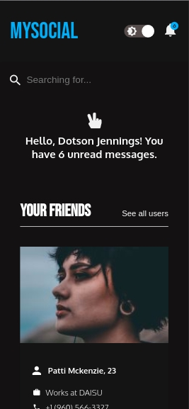
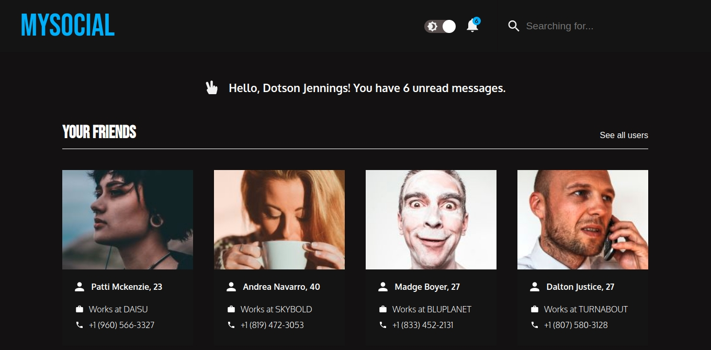
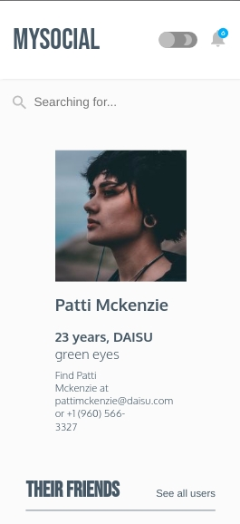
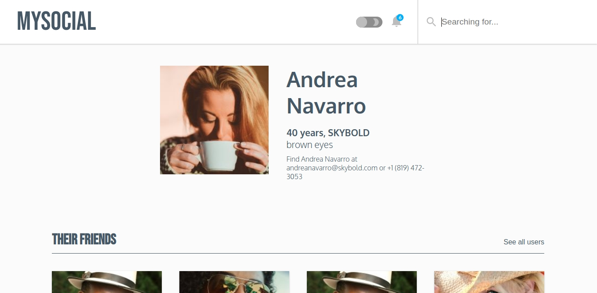
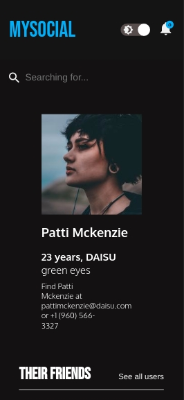
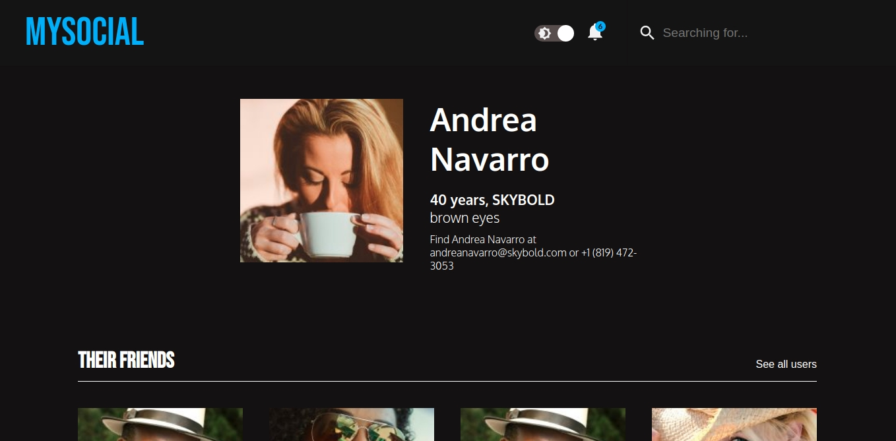

# Dialog FullStack (react/pwa/node) Test

## Apresentação
Olá, avaliador(a)!

Me chamo Pedro Mihael, e esta é a resposta ao teste do processo seletivo para desenvolvedor full stack.

As descrições para rodar os serviços estão logo abaixo.

Se desejar, pode ver histórico de commits, esforço demandando, progresso e afins nos repositórios originais.

-[API](https://github.com/pedromihael/express-graphql-api)
-[PWA](https://github.com/pedromihael/react-social-network)

Agradeço desde já pela oportunidade.

## Descrição da API
A API possui uma query `list` polimórfica, podendo ser feita sem parâmetro nenhum, ou passando um `name: String` como parâmetro.

Dado o nome, um algoritmo com regex faz a busca dos itens na camada de dados.

A cada requisição, um middleware faz o registro da request num arquivo em `/src/infrastructure/`.

Exemplo:
```javascript
  {
    list {
      _id
      name
      picture
      age
      eyeColor
      company
      email
      phone
      greeting
      friends {
        _id
        name
        picture
        age
        eyeColor
        company
        email
        phone
      }
    }
  }
```

### Stack:
- [x] NodeJS
- [x] GraphQL com Apollo Server
- [x] Express
- [x] Morgan
- [x] Jest
- [x] Typescript

### Conceitos utilizados:
- [x] Clean Architecture
- [x] DDD
- [x] Injeção de dependência
- [x] Testes unitários
- [x] SOLID (S, O, I, D)
- [x] Build Pattern
- [x] Singleton Pattern
- [x] Repository Pattern


### Executar o projeto
`yarn` baixa e instala os pacotes necessários.
`yarn start` serve a api na porta 4000.

### Testes
`yarn test` executa os testes unitários.

### cURL
curl 'http://localhost:4000/graphql' -sH 'Accept-Encoding: gzip, deflate, br' -H 'Content-Type: application/json' -H 'Accept: application/json' -H 'Connection: keep-alive' -H 'DNT: 1' -H 'Origin: http://localhost:4000' --data-binary '{"query":"{list {_id index picture age eyeColor name company email phone greeting}}"}'


## Descrição do React/PWA
Esta PWA entrega uma rede social de amigos básica, com página principal, página de amigos, uma barra de pesquisa e a possibilidade de trocar de tema de claro para escuro, e vice-versa.
### Capturas de tela












### Stack:
-[x] React com Typescript
-[x] React Hooks (useState, useEffect, useCallback, useMemo, useContext)
-[x] Custom Hooks
-[x] React Router
-[x] Apollo client

### Conceitos utilizados
-[x] CSS-in-JS com Styled-components
-[x] Responsividade com CSS Grid e Flexbox
-[x] Service Worker para uso offline
-[x] Arquitetura SMACSS
-[x] Acessibilidade (modo noturno)
-[x] Disposição intencional de feature não implementada para validar hipótese (conceito de gestão de produtos)

### Executar o projeto
`yarn` baixa e instala os pacotes necessários.
`yarn start` serve a pwa na porta 3000.

