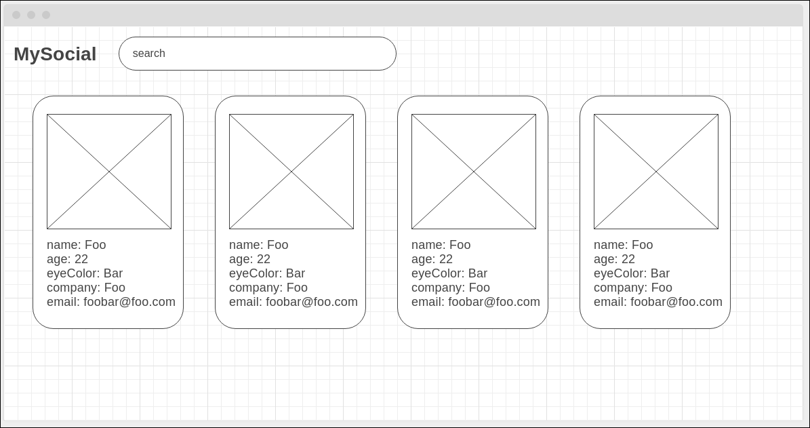
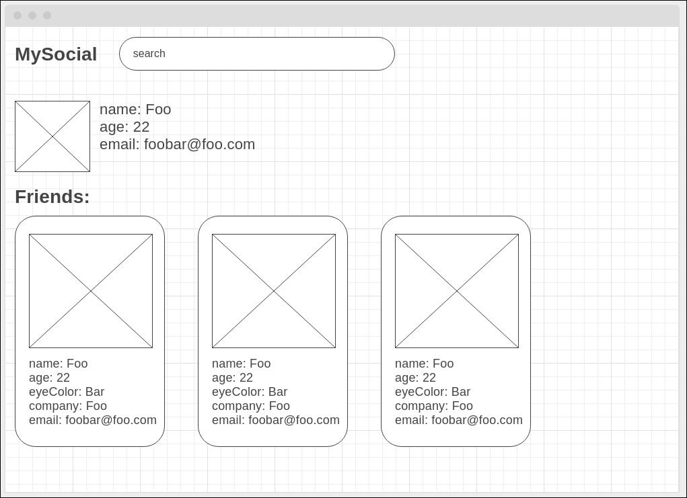

# Dialog FullStack (react/pwa/node) Test

## Objetivo

Desenvolver uma API GraphQL node e um front-end React/PWA:

## Descrição da API

Deve conter uma query `list()`.

A chamada query `list` sem parâmetro (o termo da busca por nome) deverá retornar todos os itens.

Se fornecido o argumento da busca `name`, deverá retornar os dados que contém parte da string, usar RegEx no filtro.

Download: [Data JSON](db.json)

Modelo:
```javascript
[
    {
        "_id": "5f1b3f4b7917ef26107bd58c",
        "index": 0,
        "picture": "https://i.pravatar.cc/200?u=5f1b3f4b7917ef26107bd58c",
        "age": 37,
        "eyeColor": "brown",
        "name": "Weber Stein",
        "company": "VIAGRAND",
        "email": "weber.stein@viagrand.ca",
        "phone": "+1 (866) 533-3564",
        "friends": [
          {
            "_id": "5f1d7f3e8882c9c811b111ce",
            "index": 0,
            "picture": "https://i.pravatar.cc/200?u=5f1d7f3e8882c9c811b111ce",
            "age": 23,
            "eyeColor": "green",
            "name": "Patti Mckenzie",
            "company": "DAISU",
            "email": "pattimckenzie@daisu.com",
            "phone": "+1 (960) 566-3327"
          },
        ],
        "greeting": "Hello, Weber! You have 9 unread messages."
    }
]
```

### Stack:
- GraphQL (apollo ou relay)
- Express

### Requisitos:
- colocar um middleware no Express para log dos requests
- no final desse `README.md` colocar uma chamada funcional para a API em `curl`.

### Diferencial

- Usar TypeScript
- Regex da pesquisa: considerar caractere de espaço, dado o payload acima `name: Weber Stein`, se entrar com `we in` deve retornar no resultado `Weber Stein`

### Executar o projeto

Deverá executar com `yarn start` na porta 4000


## Descrição do React/PWA

### Tela Inicial


### Tela detalhe de amigos



### Stack:
- React
- React Hooks
- React Router
- Apollo client (opcional)
- styled-components
- CSS Grid
  - deve ser responsivo, no celular exibir apenas um card na horizontal.
- Service Worker
  - app deve funcionar off-line (páginas que foram visitadas)

### Diferencial

- Usar TypeScript

### Executar o projeto

Deverá executar com `yarn start` na porta 3000


### Anotações que valem menção colocar aqui:
...
Projeto desenvolvido por Camila Correia

### Design
   Inspirado nos documentos fornecidos desenvolvi um figma para me basear no front

   [Figma](https://www.figma.com/file/wHNorU8obuGEZJygMFG7NK/Dailog-Challenge?type=design&node-id=0%3A1&mode=design&t=OfmG6cFMh9RPiEcz-1)

### Organização de tarefas
    No meu dia a dia de trabalh tenho contato com Jira e Trello, fiz um para que pudesse
    organizar as historias e deixar registros do que já tinha sido desenvolvido
    Fiz organização de features por branch e PR's para ir aos poucos montando a aplicação

  - [Trello](https://trello.com/b/edpDg0yf/dialog-challenge)
    ## Branchs
     A nomenclaturas das branchs foi de acordo com os cards gerados no trello
    ## Commits
    As descrições tive a opção de deixar tudo em inglês e segui o Conventional Commits
### Estrutura de pastas e padrões
    Nos lugares onde desenvolvi sempre tinhamos padrões a seguir e por conta disso
    decidi em ter padrões nesse projeto, tais como, separação por componentes, configuração de prettier, camelCase nas nomenclaturas, arrow function, clean code e etc 
    Pensando sempre no desenvolvimento póstumo, onde outra pessoa irá fazer manutenção se encontrar com mais facilidade

### Rodar a aplicação
    Versão node utilizado 18.16.0
    Se possível, dê preferência ao nvm
  ## Etapas de instalação back-end
    Conforme solicitado, o back está na porta 4000

    - Certifique-se de ter o Node.js instalado em seu sistema.
    - Clone este repositório em sua máquina local.
    - Abra o terminal na pasta raiz do projeto
    - Para rodar fazer da seguinte forma sequencial
    - Ir no terminal, dar os seguintes comandos
    -> Para acessar a pasta do back = `cd dialog-challenge-back` 
    -> Execute o comando `npm install` ou `npm i` para instalar todas as dependências do projeto.
    -> Para rodar o projeto do back, execute `npm start`
  
  
   ## Etapas de instalação front-end
    Conforme solicitado, o front está na porta 3000

    - Certifique-se de ter o Node.js instalado em seu sistema.
    - Clone este repositório em sua máquina local.
    - Abra o terminal na pasta raiz do projeto
    - Para rodar fazer da seguinte forma sequencial
    - Ir no terminal, dar os seguintes comandos
    -> Para acessar a pasta do front = `cd dialog-challenge-front` 
    -> Execute o comando `yarn install` ou `yarn` para instalar todas as dependências do projeto.
    -> Para rodar o projeto do front, execute `yarn start`

   ### Considerações finais
    Desenvolver este teste utilizando React, TypeScript e PWA foi uma experiência enriquecedora. Essas tecnologias são amplamente utilizadas no desenvolvimento web moderno e possuem várias vantagens, como o aumento da produtividade, a facilidade de manutenção do código e a possibilidade de criar aplicativos web que funcionam offline.

    Durante o processo de criação deste projeto, pude aprofundar meus conhecimentos nessas tecnologias e explorar diferentes conceitos, como componentização, gerenciamento de estado e roteamento de páginas. Além disso, o uso do TypeScript adicionou uma camada extra de segurança ao código, garantindo a detecção precoce de erros.

    Espero que este teste demonstre minhas habilidades e meu comprometimento com a qualidade do código. Sinta-se à vontade para explorar o projeto, verificar o código-fonte e testar as funcionalidades implementadas.

    Agradeço pela oportunidade de realizar este teste e estou disponível para qualquer esclarecimento adicional.


