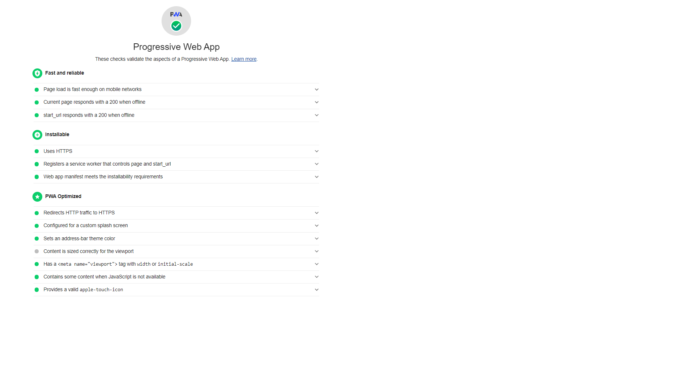

Esse projeto tem como objetivo listar Álbuns de um determinado artista seguindo e atendendo as diretrizes especifícadas. Alcançando todos os requisitos necessários para ser considerado um PWA, segundo [Lighthouse](https://developers.google.com/web/tools/lighthouse/).

**Sequência de comandos necessários para a execução ( todos no diretório raiz do projeto )**

- npm i ([instalação do npm](https://www.npmjs.com/get-npm))
- npm run build
- now ([instalação do now](https://zeit.co/docs))
- E pronto! Você irá receber um link como esse [https://criticalmasstest.mathiew0.now.sh/](https://criticalmasstest.mathiew0.now.sh/) e poderá testar.

**Imagem da avaliação do Lighthouse**

